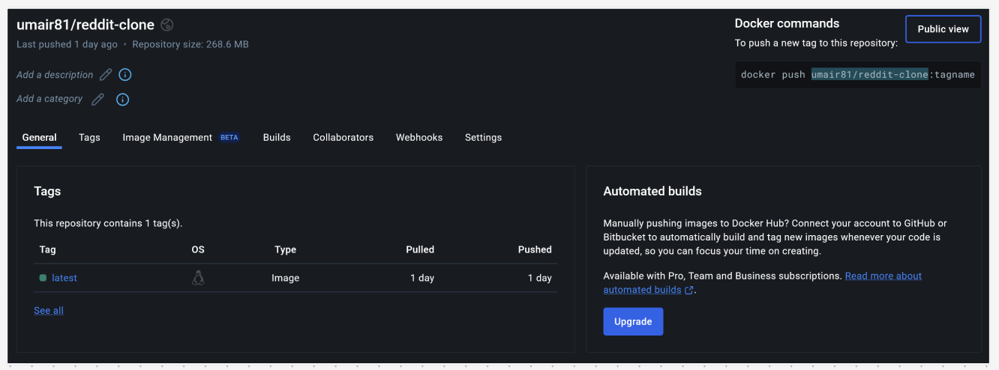

# Reddit Clone Application

This project is a Reddit clone application deployed using Kubernetes, Docker, and Minikube on AWS. The application is containerized using Docker, and the Docker image is pushed to Docker Hub. Kubernetes is used for orchestration, and Minikube is used for local Kubernetes cluster management.

## Technologies Used

- **Docker**: For containerizing the application.
- **Docker Hub**: For storing and managing Docker images.
- **Kubernetes**: For orchestrating the containers.
- **Minikube**: For running a local Kubernetes cluster.
- **CI/CD**: For continuous integration and continuous deployment.
- **Monitoring and Logging**: For monitoring the application and logging events.
- **AWS** : For cloud service

## Prerequisites

Before you begin, ensure you have the following installed:

- [Docker](https://docs.docker.com/get-docker/)
- [Kubernetes](https://kubernetes.io/docs/tasks/tools/)
- [Minikube](https://minikube.sigs.k8s.io/docs/start/)
- [kubectl](https://kubernetes.io/docs/tasks/tools/install-kubectl/)

## Installation

1. **Clone the Repository**

```
git clone https://github.com/Umair-Devops-425/Umair-Devops-425-Deploying_Reddit_Clone_using_Kubernetes_.git
```

```
cd Umair-Devops-425-Deploying_Reddit_Clone_using_Kubernetes_
```

2. Build the Docker Image

```
docker build -t umair81/reddit-clone:latest
```

3. Push the Docker Image to Docker Hub

```
docker push umair81/reddit-clone:latest
```



## Deployment

1. **Start Minikube**

```
minikube start
```

2. **Deploy the Application to Kubernetes**

```
kubectl apply -f k8s-deployment.yaml
```

```
kubectl apply -f k8s-service.yaml
```

3. **Access the Application**

```
minikube service reddit-clone-service
```


## CI/CD

This project uses a CI/CD pipeline to automate the build, test, and deployment process. The pipeline is configured to:

1. Automatically build the Docker image when changes are pushed to the main branch.

2. Run tests to ensure the application is working as expected.

3. Deploy the application to Kubernetes if the tests pass.